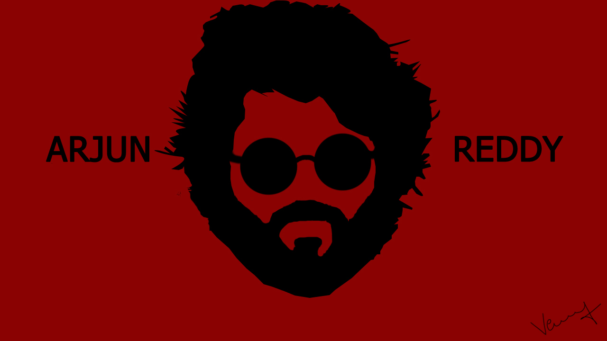

# vector-art
This page gives basic overview of vector art and some of my work
## Contents of the page
1. what is vector art?
2. Softwares I used
3. My Work
4. References
## What is Vector art?
Vector art is a computer-made image that is made up of points, lines, and curves created using vector illustration software programs, such as Adobe Illustrator or Photoshop. The technical definition of vector graphics is complicated, but in a nutshell vector files are a type of graphic that uses mathematical algorithms, allowing the image to be scaled or modified without loss of image quality or resolution.
## Softwares I used
1. Adobe Illustrator
2. Adobe Photoshop

Refer the below link to know other softwares which are used to do vector art.
[Softwares](https://www.smashingmagazine.com/2008/12/20-vector-graphic-editors-reviewed/)
## My Work
I tried my best to do this art, ignore if its bad.

![]
![]
![]
## References
1.https://www.qualitylogoproducts.com/promo-university/beginners-guide-to-vector-art.html
2.https://www.smashingmagazine.com/2008/12/20-vector-graphic-editors-reviewed/
